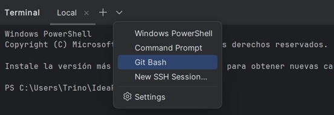
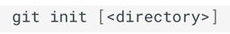

## 1. Preparación del entorno

En este curso, se empleará la terminal para interactuar con Git, pero esto no significa que 
sea la única forma de hacerlo. De hecho, prácticamente todos los entornos de desarrollo 
modernos tienen integración con Git, lo que permite realizar las mismas operaciones que 
proporciona la terminal, pero de forma más visual e intuitiva. 
Sin embargo, es importante conocer cómo funcionan los comandos de Git en la terminal, 
por diferentes razones: 

* **Portabilidad**: La terminal es un entorno común en todos los sistemas operativos y 
en cualquier entorno de desarrollo.

* **Flexibilidad**: La terminal permite realizar operaciones más avanzadas y 
personalizadas que las interfaces gráficas.

* **Comprensión**: Permite entender cómo funcionan los pedidos de Git y los procesos que realiza en el sistema. 

### 1.1 Instalación de GIT
 Git está disponible en la página oficial para Windows, Linux y macOS.

### 1.2 Integración con IntelliJ IDEA
IntellJ IDEA permite abrir una terminal integrada en la parte inferior de la ventana, lo que facilita su utilización sin cambiar de ventana.

Se puede abrir la terminal mediante el menú **Terminal**, sin embargo, en sistemas 
Windows, la terminal integrada utiliza PowerShell por defecto, pero se puede seleccionar Git Bash desde el menú desplegable de la terminal, donde también se puede configurar que está opción sea la predeterminada:

### 1.3 Clientes GIT gráficos

 Como se ha indicado, Git es un software gestionado por línea de comandos, pero eso no significa que se tenga que utilizar la línea de comandos para hacerlo funcionar. ¡Existen muchísimas opciones para manejarlo! Existen numerosos GUIs (interfaces gráficas de usuario) para utilizar Git, algunos de los más empleados son:
 - [GitKraken](http://cefire.edu.gva.es/)
 - [SourceTree](https://www.sourcetreeapp.com/)
 - [GitHub Desktop](https://github.com/apps/desktop)

## 2 Clientes GIT gráficos
 Git es un sistema de control de versiones libre y distribuido diseñado para gestionar pequeños y grandes proyectos con rapidez y eficiencia. El objetivo principal de Git es controlar y gestionar los cambios realizados en una enorme cantidad de ficheros de una manera fácil y eficiente.

Git fue diseñado en 2005 por Linus Torvalds, creador del kernel del sistema operativo Linux, y desde entonces se ha convertido en una herramienta fundamental e imprescindible en la gestión de código fuente en proyectos colaborativos.

Git está basado en repositorios, que se inicializan en un directorio concreto y contienen toda la información de los cambios realizados en todo el árbol de directorios y ficheros a partir de ese directorio.

Los principales objetivos y características de Git son: 
- **Control de versiones**: Git realiza un seguimiento de las modificaciones en los archivos a lo largo del tiempo, lo que permite a los desarrolladores ver y recuperar versiones anteriores de su código. Esta característica es esencial para trabajar en equipos y solucionar problemas o errores. 

- **Distribuido**: Cada copia de un repositorio Git contiene todo el historial de cambios y puede operar de forma independiente. Esto facilita el trabajo sin conexión y la colaboración en equipos distribuidos. 

- **Rama y fusión**: Git facilita la creación de ramas (branching) para desarrollar características o solucionar problemas sin afectar a la rama principal. Luego, se puede fusionar (merge) las ramas de nuevo en la rama principal cuando estén a punto.

- **Gestión de conflictos**: Git ofrece herramientas para gestionar conflictos en caso de que dos o más personas hayan realizado cambios en la misma parte del código. Los desarrolladores pueden resolver estos conflictos manualmente.

- **Colaboración**: Git facilita la colaboración en proyectos de código abierto o en equipos, ya que permite a múltiples personas trabajar en el mismo proyecto de forma eficiente. Plataformas como GitHub, GitLab y Bitbucket se utilizan comúnmente para alojar repositorios Git online y colaborar en proyectos.

- **Código abierto y gratuito**: Git es de código abierto y gratuito, lo que significa que cualquiera puede utilizarlo sin coste y contribuir al desarrollo de la herramienta. 

### 2.1 Inicialización de un repositorio
 Para empezar a utilizar Git en un proyecto, primero es necesario inicializar un repositorio en un directorio concreto.

 

 - *directory* : Directorio donde se desea inicializar el repositorio. Si no se especifica, se utiliza el directorio actual.

 Este comando crea un directorio oculto llamado .git que contiene toda la información relativa al **Repositorio Local**.