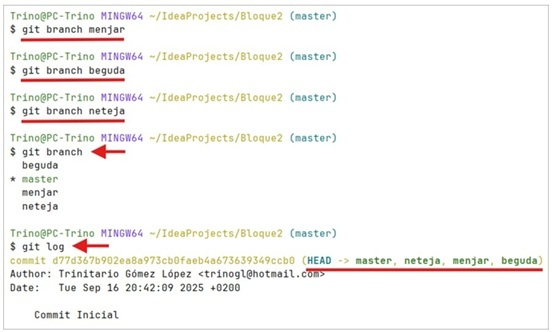

## 1. Ramas
* Las **branch (ramas)** permiten el desarrollo colaborativo y en paralelo de un proyecto.

* La rama principal de un proyecto originalmente se llamaba master, pero 
es preferible utilizar el nombre **main** para evitar la nomenclatura **master/slave**.


### 1.2 Mostrar ramas
* Para mostrar las ramas de un repositorio se debe emplear el comando: 
```python
git branch [--list] [-a | --all] [-v | --verbose]
```
 * El comando **git branch** muestra las ramas si:
    * No se utiliza ninguna opción.
    * Se utiliza la opción **--list**.
 * Más opciones:
    * **[-a | --all]**: Opcional. Muestra todas las ramas, incluyendo las remotas.
    * **[-v | --verbose]**: Opcional. Muestra más información de cada rama.


### 1.3 Crear ramas
* Para crear una nueva rama se debe emplear el comando: 
```python
git branch [-f | --force] <nombre>
```
    * **[-f | --force]**: Opcional. Fuerza la creación de la rama. 
    * **nom**: Nombre de la nueva rama.

??? example "Ejemplo: Crear Ramas"
     

    ??? note "Ramas"
        ``` mermaid
        graph BT;
        Commit_Inicial --> Nuevo_Desarrollo;
        Commit_Inicial --> Módulo_Imagenes;
        Módulo_Imagenes --> Se_anaden_imagenes_JPG;
        Nuevo_Desarrollo --> Merge_Soluciones;
        ```


### 1.4 Cambiar de rama
*  Existen dos órdenes para cambiar de rama, cada una con su propia sintaxis y opciones:

```python
git checkout <nom> # (1)!
git switch <nom> # (2)!
``` 
 
 1. nom : Nombre de la rama.
 2. nom : Nombre de la rama.


### 1.3 - 1.4  Crear y cambiar de rama
* En el siguiente vídeo se puede observar un ejemplo práctico donde se muestra cómo crea y se cambia de ramas:
[<iframe width="560" height="315" style="display:block; margin:auto;" src="https://www.youtube.com/embed/JDMgox8cc1c?si=fijejUbRGS8A-ZgM" title="YouTube video player" frameborder="0" allow="accelerometer; autoplay; clipboard-write; encrypted-media; gyroscope; picture-in-picture; web-share" referrerpolicy="strict-origin-when-cross-origin" allowfullscreen></iframe>](https://youtu.be/JDMgox8cc1c?si=Y3IwbUfi1ql073XW)